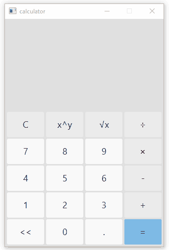

# The calculator

## Project description

The goal of the project is to write a calculator in JavaFX.

The calculator implements the operations of: 
- addition
- subtraction
- multiplication
- division
- exponentiation
- taking the root

## Example of execution
 

## Technologies

- Java 
- JavaFX
 
## About the project

- developer: Kaleev Egor
- development date: 2020
- reason for development: subject "Object-oriented programming"